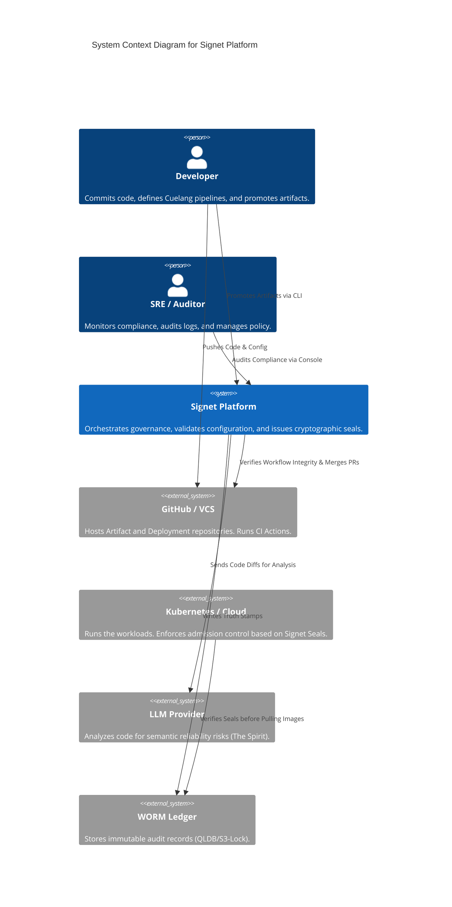
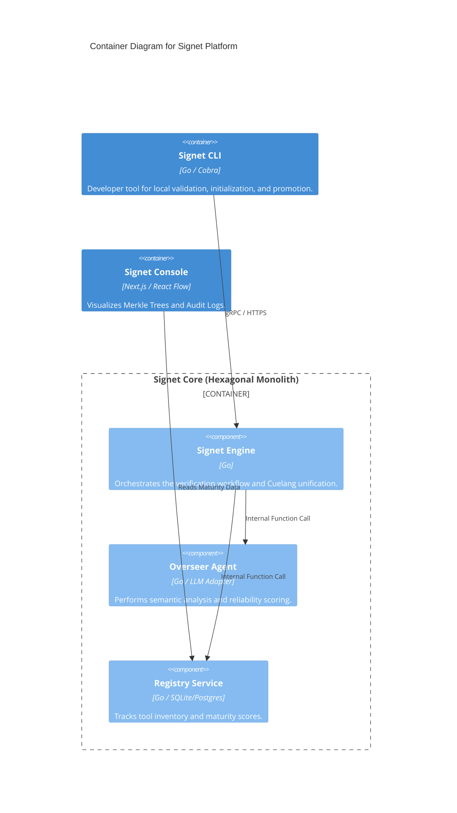

# 🏗️ System Architecture: Context & Container

**Status:** Draft | **Version:** 1.0

This document defines the high-level architecture of the Signet Platform using the **C4 Model**.

## 1. System Context Diagram (Level 1)
Signet sits between the Developer, the Version Control System (GitHub), and the Cloud Infrastructure (Kubernetes/AWS).

2. Container Diagram (Level 2)
Zooming into the Signet Platform, we see the modular monolith structure following Hexagonal Architecture.

